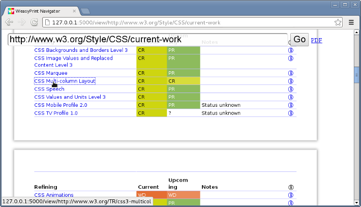

Tutorial
========

As a standalone program
-----------------------

Once you have WeasyPrint :doc:`installed </install>`, you should have a
``weasyprint`` executable. Using it can be as simple as this:

.. code-block:: sh

    weasyprint http://weasyprint.org /tmp/weasyprint-website.pdf

You may see warnings on *stderr* about unsupported CSS properties.
See :ref:`command-line-api` for the details of all available options.

In particular, the ``-s`` option can add a filename for a
:ref:`user stylesheet <stylesheet-origins>`. For quick experimentation
however, you may not want to create a file. In bash or zsh, you can
use the shell’s redirection instead:

.. code-block:: sh

    weasyprint http://weasyprint.org /tmp/weasyprint-website.pdf \
        -s <(echo 'body { font-family: serif !important }')

If you have many documents to convert you may prefer using the Python API
in long-lived processes to avoid paying the start-up costs every time.

As a Python library
-------------------
.. currentmodule:: weasyprint

Quickstart
..........

The Python version of the above example goes like this:

.. code-block:: python

    from weasyprint import HTML
    HTML('http://weasyprint.org/').write_pdf('/tmp/weasyprint-website.pdf')

… or with the inline stylesheet:

.. code-block:: python

    from weasyprint import HTML, CSS
    HTML('http://weasyprint.org/').write_pdf('/tmp/weasyprint-website.pdf',
        stylesheets=[CSS(string='body { font-family: serif !important }')])

Instantiating HTML and CSS objects
..................................

If you have a file name, an absolute URL or a readable file-like object,
you can just pass it to :class:`HTML` or :class:`CSS` to create an instance.
Alternatively, use a named argument so that no guessing is involved:

.. code-block:: python

    from weasyprint import HTML

    HTML('../foo.html')  # Same as …
    HTML(filename='../foo.html')

    HTML('http://weasyprint.org')  # Same as …
    HTML(url='http://weasyprint.org')

    HTML(sys.stdin)  # Same as …
    HTML(file_obj=sys.stdin)

If you have a byte string, Unicode string, or lxml tree already in memory
you can also pass that, although the argument must be named:

.. code-block:: python

    from weasyprint import HTML

    # HTML('<h1>foo') would be filename
    HTML(string='''
        <h1>The title</h1>
        
Content goes here
    ''')
    CSS(string='@page { size: A3; margin: 1cm }')

    # Use a different lxml parser:
    HTML(tree=lxml.html.html5parser.parse('../foo.html'))

If you have ``@font-face`` rules in your CSS, you have to create a
``FontConfiguration`` object:

.. code-block:: python

    from weasyprint import HTML, CSS
    from weasyprint.fonts import FontConfiguration

    font_config = FontConfiguration()
    HTML(string='<h1>The title</h1>')
    CSS(string='''
        @font-face {
            font-family: Gentium;
            src: url(http://example.com/fonts/Gentium.otf);
        }
        h1 { font-family: Gentium }''', font_config=font_config)

Rendering to a single file
..........................

Once you have a :class:`HTML` object, call its :meth:`~HTML.write_pdf` or
:meth:`~HTML.write_png` method to get the rendered document in a single
PDF or PNG file.

Without arguments, these methods return a byte string in memory. If you
pass a file name or a writable file-like object, they will write there
directly instead. (**Warning**: with a filename, these methods will
overwrite existing files silently.)

Individual pages, meta-data, other output formats, …
....................................................

.. currentmodule:: weasyprint.document

If you want more than a single PDF, the :meth:`~weasyprint.HTML.render`
method gives you a :class:`Document` object with access to individual
:class:`Page` objects. Thus you can get the number of pages, their size\ [#]_,
the details of hyperlinks and bookmarks, etc.
Documents also have :meth:`~Document.write_pdf` and :meth:`~Document.write_png`
methods, and you can get a subset of the pages with :meth:`~Document.copy()`.
Finally, for ultimate control, :meth:`~Page.paint` individual pages anywhere
on any type of cairo surface.

.. [#] Pages in the same document do not always have the same size.

See the :ref:`python-api` for details. A few random example:

.. code-block:: python

    # Write odd and even pages separately:
    #   Lists count from 0 but page numbers usually from 1
    #   [::2] is a slice of even list indexes but odd-numbered pages.
    document.copy(document.pages[::2]).write_pdf('odd_pages.pdf')
    document.copy(document.pages[1::2]).write_pdf('even_pages.pdf')

.. code-block:: python

    # Write one PNG image per page:
    for i, page in enumerate(document.pages):
        document.copy([page]).write_png('page_%s.png' % i)

.. code-block:: python

    # Some previous versions of WeasyPrint had a method like this:
    def get_png_pages(document):
        """Yield (png_bytes, width, height) tuples."""
        for page in document.pages:
            yield document.copy([page]).write_png()

.. code-block:: python

    # Print the outline of the document.
    # Output on http://www.w3.org/TR/CSS21/intro.html
    #     1. Introduction to CSS 2.1 (page 2)
    #       1. A brief CSS 2.1 tutorial for HTML (page 2)
    #       2. A brief CSS 2.1 tutorial for XML (page 5)
    #       3. The CSS 2.1 processing model (page 6)
    #         1. The canvas (page 7)
    #         2. CSS 2.1 addressing model (page 7)
    #       4. CSS design principles (page 8)
    def print_outline(bookmarks, indent=0):
        for i, (label, (page, _, _), children) in enumerate(bookmarks, 1):
            print('%s%d. %s (page %d)' % (
                ' ' * indent, i, label.lstrip('0123456789. '), page))
            print_outline(children, indent + 2)
    print_outline(document.make_bookmark_tree())

.. code-block:: python

    # PostScript on standard output:
    surface = cairo.PSSurface(sys.stdout, 1, 1)
    context = cairo.Context(surface)
    for page in document.pages:
        # 0.75 = 72 PostScript point per inch / 96 CSS pixel per inch
        surface.set_size(page.width * 0.75, page.height * 0.75)
        page.paint(context, scale=0.75)
        surface.show_page()
    surface.finish()

.. _url-fetchers:

URL fetchers
............

WeasyPrint goes through a *URL fetcher* to fetch external resources such as
images or CSS stylesheets. The default fetcher can natively open file and
HTTP URLs, but the HTTP client does not support advanced features like cookies
or authentication. This can be worked-around by passing a custom
``url_fetcher`` callable to the :class:`HTML` or :class:`CSS` classes.
It must have the same signature as :func:`~weasyprint.default_url_fetcher`.

Custom fetchers can choose to handle some URLs and defer others
to the default fetcher:

.. code-block:: python

    from weasyprint import default_url_fetcher, HTML

    def my_fetcher(url):
        if url.startswith('graph:'):
            graph_data = map(float, url[6:].split(','))
            return dict(string=generate_graph(graph_data),
                        mime_type='image/png')
        else:
            return weasyprint.default_url_fetcher(url)

    source = ''
    HTML(string=source, url_fetcher=my_fetcher).write_pdf('out.pdf')

Flask-WeasyPrint_ makes use of a custom URL fetcher to integrate WeasyPrint
with a Flask_ application and short-cut the network for resources that are
within the same application.

.. _Flask-WeasyPrint: http://packages.python.org/Flask-WeasyPrint/
.. _Flask: http://flask.pocoo.org/

Logging
.......

Most errors (unsupported CSS property, missing image, ...)
are not fatal and will not prevent a document from being rendered.

WeasyPrint uses the :mod:`logging` module from the Python standard library
to log these errors and let you know about them.
Logged messaged will go to *stderr* by default. You can change that by
configuring the ``weasyprint`` logger object:

.. code-block:: python

    import logging
    logger = logging.getLogger('weasyprint')
    logger.handlers = []  # Remove the default stderr handler
    logger.addHandler(logging.FileHandler('/path/to/weasyprint.log'))

See the documentation of the :mod:`logging` module for details.

.. _navigator:

WeasyPrint Navigator
--------------------

*WeasyPrint Navigator* is a very limited web browser, running
in your web browser. Start it with:

.. code-block:: sh

    python -m weasyprint.navigator

… and open your browser at http://127.0.0.1:5000/.

It does not support cookies, forms, or many other things that you would
expect from a “real” browser. It only shows the PNG output from WeasyPrint
with overlaid clickable hyperlinks. It is mostly useful for playing and testing.

Errors
------

If you get an exception during rendering, it is probably a bug in WeasyPrint.
Please copy the full traceback and report it on our `issue tracker`_.

.. _issue tracker: https://github.com/Kozea/WeasyPrint/issues

.. _stylesheet-origins:

Stylesheet origins
------------------

HTML documents are rendered with stylesheets from three *origins*:

* The HTML5 `user agent stylesheet`_ (defines the default appearance
  of HTML elements);
* Author stylesheets embedded in the document in ``<style>`` elements
  or linked by ``<link rel=stylesheet>`` elements;
* User stylesheets provided in the API.

Keep in mind that *user* stylesheets have a lower priority than *author*
stylesheets in the cascade_, unless you use `!important`_ in declarations
to raise their priority.

.. _user agent stylesheet: https://github.com/Kozea/WeasyPrint/blob/master/weasyprint/css/html5_ua.css
.. _cascade: http://www.w3.org/TR/CSS21/cascade.html#cascading-order
.. _!important: http://www.w3.org/TR/CSS21/cascade.html#important-rules
